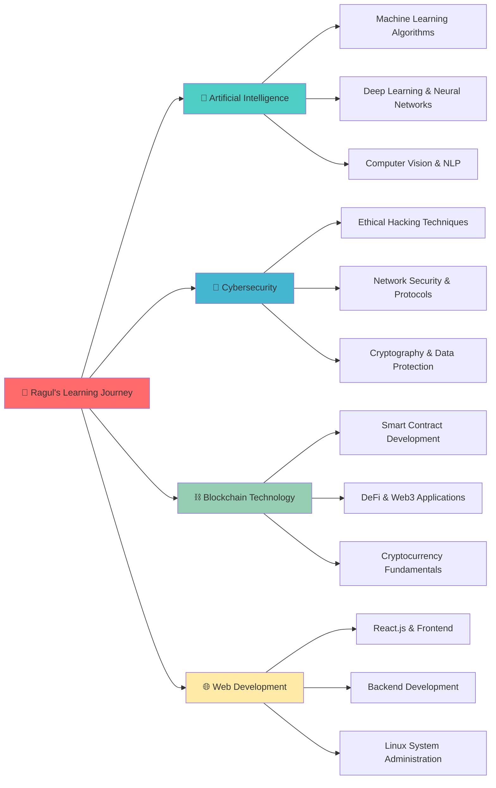

# Hi there! 👋 I'm Ragul Balaji

<div align="center">
  
</div>


## 🚀 About Me

```python
class RagulBalaji:
    def __init__(self):
        self.name = "Ragul Balaji"
        self.role = "Computer Science Student & Tech Enthusiast"
        self.location = "Coimbatore, Tamil Nadu, India"
        self.education = "Coimbatore Institute of Technology"
        self.current_focus = ["AI & Machine Learning", "Cybersecurity", "Blockchain"]
        self.languages = ["Python", "C", "C++", "SQL"]
        self.exploring = ["Linux Systems", "React Development"]
        self.motto = "Learning today, leading tomorrow!"
    
    def get_current_status(self):
        return {
            "🎓": "Studying Computer Science at CIT",
            "🤖": "Diving deep into AI & ML algorithms",
            "🔐": "Mastering cybersecurity fundamentals",
            "⛓️": "Exploring blockchain technology",
            "💻": "Building projects with Python & React"
        }
    
    def say_hello(self):
        print("Thanks for visiting! Let's connect and build the future together!")

ragul = RagulBalaji()
ragul.say_hello()
```

## 🎓 Academic Journey

- 🏛️ **Currently pursuing** Computer Science at **Coimbatore Institute of Technology**
- 🌟 **Passionate about** cutting-edge technologies and their real-world applications
- 📚 **Learning** through hands-on projects and continuous skill development
- 🎯 **Goal:** To become a versatile developer contributing to tech innovation

## 🛠️ Tech Arsenal

<div align="center">

### Programming Languages


### Technologies & Frameworks


### Specialized Areas


</div>

## 📊 GitHub Statistics

<div align="center">
  
  
</div>

<div align="center">
  
</div>

## 🏆 Achievements & Trophies
<div align="center">
  
</div>

## 🌟 Current Learning Path



## 📈 Contribution Graph
<div align="center">
  
</div>

## 🔥 What I'm Currently Working On

- 🤖 **AI Projects:** Building machine learning models for real-world problem solving
- 🔐 **Security Research:** Learning ethical hacking and penetration testing techniques
- ⛓️ **Blockchain Development:** Creating smart contracts and exploring DeFi protocols
- 🌐 **Full-Stack Development:** Building responsive web applications with React
- 🐧 **Linux Mastery:** Strengthening my command-line and system administration skills
- 📚 **Continuous Learning:** Taking online courses and working on coding challenges

## 💡 My Philosophy

<div align="center">
  
*"Technology is not just about code - it's about creating solutions that make a difference in people's lives."*

**🎯 Mission:** To leverage technology for solving real-world problems  
**🌟 Vision:** Contributing to a more secure, intelligent, and decentralized digital future  
**💪 Values:** Continuous learning, ethical development, and collaborative innovation

</div>

## 🤝 Let's Connect & Collaborate!

<div align="center">

[](https://linkedin.com/in/ragul-balaji)
[](https://twitter.com/ragulbalaji)
[](mailto:ragulbalaji@gmail.com)
[](https://ragulbalaji.dev)
[](https://instagram.com/ragul.balaji)

</div>

## 📫 Open for Opportunities

- 💼 **Internships** in AI, Cybersecurity, or Blockchain development
- 🤝 **Collaboration** on innovative tech projects
- 📚 **Mentorship** opportunities to accelerate learning
- 🎤 **Speaking engagements** about emerging technologies
- 🌐 **Open source contributions** to meaningful projects

---

<div align="center">
  
  
  <br><br>
  
  **"The best way to predict the future is to create it." - Peter Drucker**
  
  <br>
  
  
</div>

### 🎲 Random Dev Quote
<div align="center">
  
</div>

---

<div align="center">
  <h3>⭐️ From <a href="https://github.com/ragulbalaji">Ragul Balaji</a> with ❤️</h3>
  <p><em>Happy Coding! 🚀</em></p>
</div>
